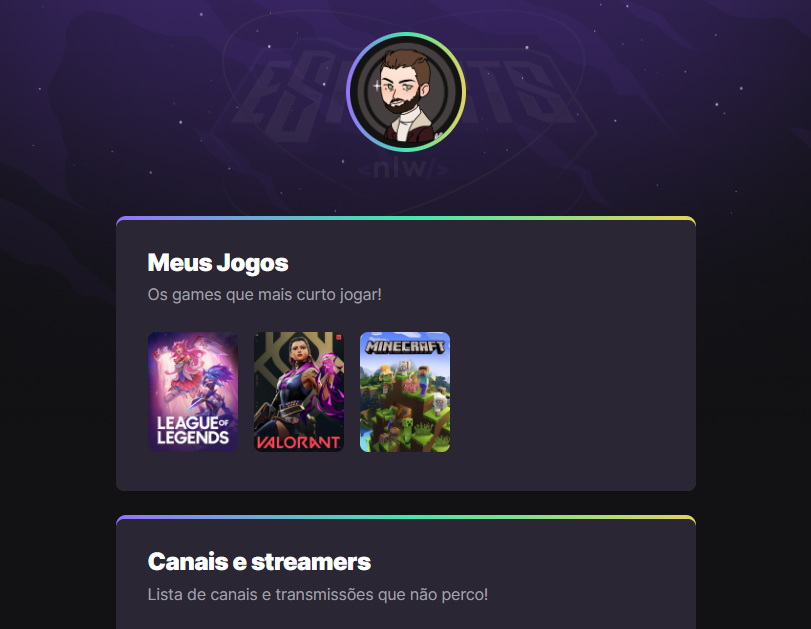

# NLW eSports - Trilha Explorer

> Trilha Explorer

Projeto construído do evento Next Level Week da Rocketseat.

[⏩Clique aqui para acessar](https://arawns1.github.io/NLW-eSports)
## 🛠 Tecnologias

 - HTML
 - CSS
 - Git e Github

## 💻 Contato

<a href="https://www.linkedin.com/in/gabriel-damico/"> 🔗 Meu linkedin </a>

Senhas.
Aula 01: levelup
Aula 02: Journey
Aula 03: UntilTheEnd
Aula 04: ProPlayer
